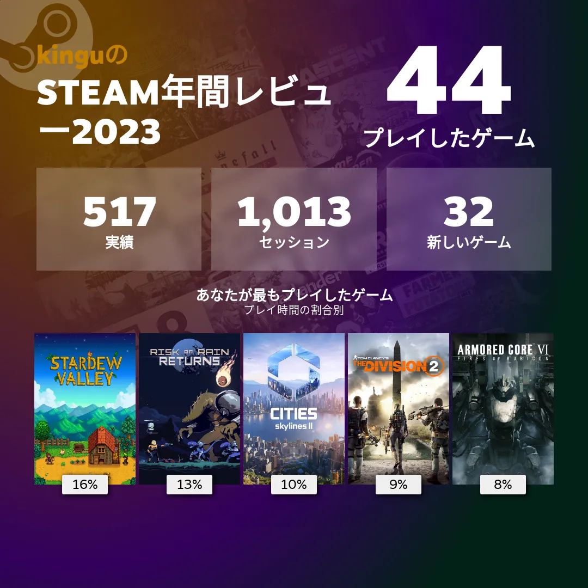

# 金具 浩平

- GitHub <https://github.com/KoheiKanagu>

## SNS

- X <https://twitter.com/i_am_kingu_pub>
- Facebook <https://www.facebook.com/k.g.kohei>

## アプリ

- App Store <https://apps.apple.com/developer/id1530720615>
- Google Play <https://play.google.com/store/apps/developer?id=Kohei+Kanagu>

## パッケージ

- pub.dev <https://pub.dev/publishers/kingu.dev/packages>

## ゲーム

- Steam <https://steamcommunity.com/id/i_am_kingu>

## 執筆

- Zenn <https://zenn.dev/kingu>

### 国際会議論文

- Kohei Kanagu, Kota Tsubouchi and Nobuhiko Nishio, "Colorful PDR: Colorizing PDR with Shopping Context in Walking", IPIN2017, Hokkaido, Japan., Sep, 2017.
- Shun Yoshimi, Kohei Kanagu, Masahiro Mochizuki, Kazuya Murao, and Nobuhiko Nishio, "PDR Trajectory Estimation using Pedestrian-Space Constraints: Real World Evaluations", HASCA2015, Osaka, Japan, Sep, 2015.

### 国際学会

- Takumi Otsuki, Kohei Kanagu, Kota Tsubouchi, Nobuhiko Nishio, "Daily action dead reckoning using smartphone sensors", 10th International Conference on Indoor Positioning and Indoor Navigation (IPIN 2019), Italy, Oct, 2019

### 国内研究会・シンポジウム等

- 金具 浩平, 川内 菜津美, 大槻 拓未, 西尾 信彦: "屋内空間における係留状態認識, 情報処理学会, マルチメディア, 分散, 協調とモバイル(DICOMO 2018)シンポジウム論文集, pp.94-99, 2018 年 7 月 4 日.
- 金具 浩平，望月 祐洋，村尾 和哉，西尾 信彦: "Fireman Dead Reckoning: 屋内における消防士向け自律航法の検討" ユビキタス・ウェアラブルワークショップ, （UWW2015）予稿集, p.37, 2015 年 12 月 19 日, ベストプレゼンテーション賞
- 吉見 駿, 金具 浩平, 望月 祐洋, 村尾 和哉, 西尾 信彦: "実環境における歩行空間制約を活用した PDR 軌跡推定" 情報処理学会, マルチメディア, 分散, 協調とモバイル(DICOMO 2015) シンポジウム論文集, pp.310-318, 2015 年 7 月 8 日, ヤングリサーチャー賞
