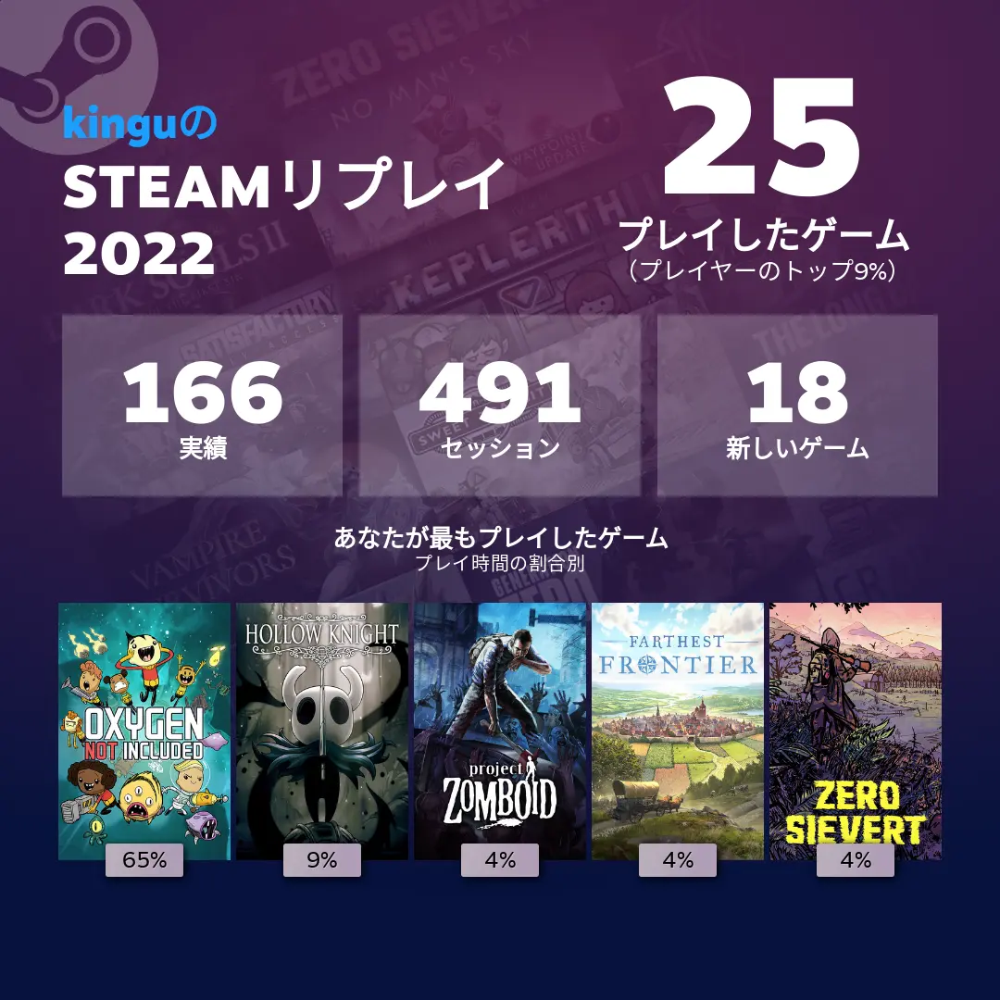
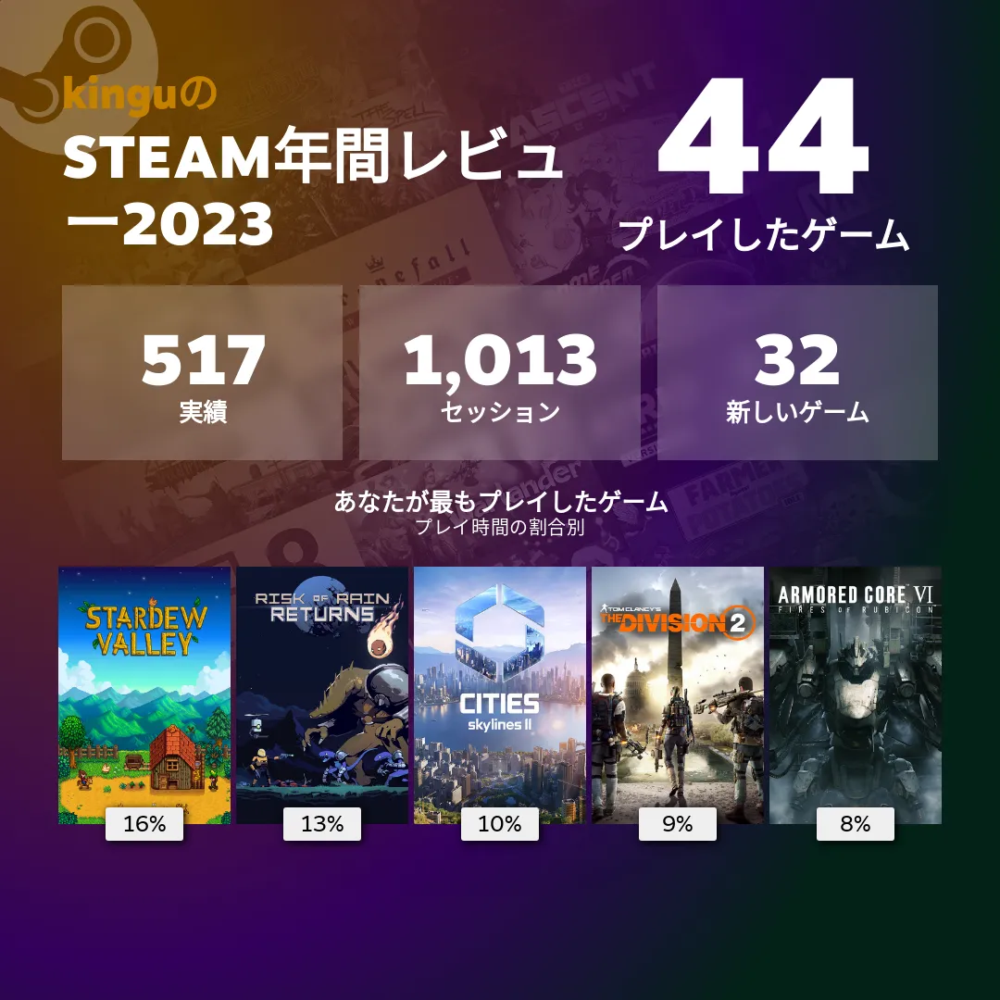

# 金具 浩平 (KANAGU Kohei)

## お仕事について

`kanagu@kingu.dev` までご連絡ください。

### [技術スタックはこちら](./technology-stack.html)

## 開発したもの

### リポジトリ

- GitHub <https://github.com/KoheiKanagu>

### パッケージ

- pub.dev <https://pub.dev/publishers/kingu.dev/packages>

### アプリ

#### [アクスタ / AcrylicStand](./apps/AcrylicStand/index.html)

#### [100 時間の法則 / 100-Hour Rule](./apps/100-Hour%20Rule/index.html)

#### [#お弁当記録 / #obento](./apps/obento/index.html)

ソースコード <https://github.com/KoheiKanagu/garage/tree/main/packages/obento>

#### [場所で音楽 / Locamusic](./apps/locamusic/index.html)

ソースコード <https://github.com/KoheiKanagu/garage/tree/main/packages/listen_to_music_by_location>

## SNS

- X <https://twitter.com/i_am_kingu_pub>
- Facebook <https://www.facebook.com/k.g.kohei>

### モル旅

- [2024/02 広島](<https://x.com/search?q=-%23%E5%BC%81%E5%BD%93%20(%23%E3%83%A2%E3%83%AB%E3%82%AB%E3%83%BC)%20(from%3Ai_am_kingu_pub)%20until%3A2024-02-19%20since%3A2024-02-16&src=typed_query&f=live>)
- [2024/05 京都](<https://x.com/search?q=-%23%E3%81%8A%E5%BC%81%E5%BD%93%E8%A8%98%E9%8C%B2%20(%23%E3%83%A2%E3%83%AB%E3%82%AB%E3%83%BC)%20(from%3Ai_am_kingu_pub)%20until%3A2024-05-29%20since%3A2024-05-25&src=typed_query&f=live>)

## ゲーム

- Steam <https://steamcommunity.com/id/i_am_kingu>

## 執筆

- Zenn <https://zenn.dev/kingu>

### 国際会議論文

- Kohei Kanagu, Kota Tsubouchi and Nobuhiko Nishio, "Colorful PDR: Colorizing PDR with Shopping Context in Walking", IPIN2017, Hokkaido, Japan., Sep, 2017.
- Shun Yoshimi, Kohei Kanagu, Masahiro Mochizuki, Kazuya Murao, and Nobuhiko Nishio, "PDR Trajectory Estimation using Pedestrian-Space Constraints: Real World Evaluations", HASCA2015, Osaka, Japan, Sep, 2015.

### 国際学会

- Takumi Otsuki, Kohei Kanagu, Kota Tsubouchi, Nobuhiko Nishio, "Daily action dead reckoning using smartphone sensors", 10th International Conference on Indoor Positioning and Indoor Navigation (IPIN 2019), Italy, Oct, 2019

### 国内研究会・シンポジウム等

- 金具 浩平, 川内 菜津美, 大槻 拓未, 西尾 信彦: "屋内空間における係留状態認識, 情報処理学会, マルチメディア, 分散, 協調とモバイル(DICOMO 2018)シンポジウム論文集, pp.94-99, 2018 年 7 月 4 日.
- 金具 浩平，望月 祐洋，村尾 和哉，西尾 信彦: "Fireman Dead Reckoning: 屋内における消防士向け自律航法の検討" ユビキタス・ウェアラブルワークショップ, （UWW2015）予稿集, p.37, 2015 年 12 月 19 日, ベストプレゼンテーション賞
- 吉見 駿, 金具 浩平, 望月 祐洋, 村尾 和哉, 西尾 信彦: "実環境における歩行空間制約を活用した PDR 軌跡推定" 情報処理学会, マルチメディア, 分散, 協調とモバイル(DICOMO 2015) シンポジウム論文集, pp.310-318, 2015 年 7 月 8 日, ヤングリサーチャー賞
